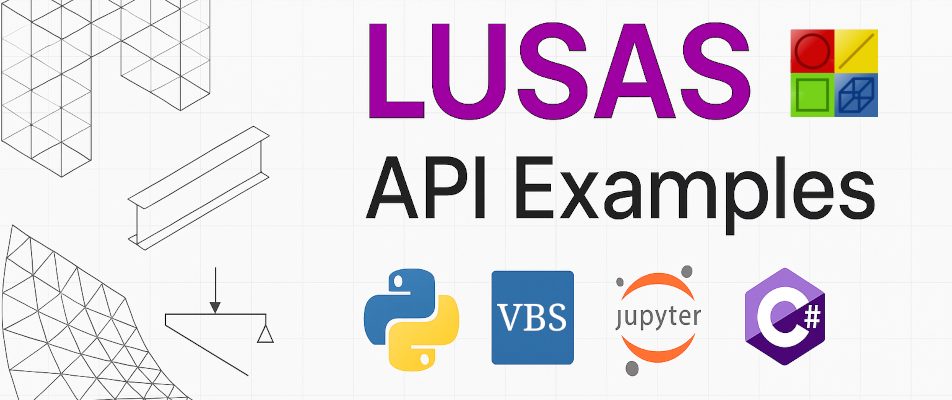

# LUSAS API (LPI) Examples

This repository provides practical and minimal examples of using the LUSAS Programming Interface (LPI) in Python, VBScript, Jupyter, and C#.

These examples are tailored for **LUSAS v21.1** (see repository branches for other versions).

## What is LUSAS?

[LUSAS](https://www.lusas.com/) is a powerful finite element analysis software used for structural, bridge, geotechnical, and general engineering simulation. The **LUSAS Programming Interface (LPI)** allows automation of model generation, material assignment, loading, solving, and result extraction (read more about it [on the website](https://www.lusas.com/products/information/lusas_programmable_interface.html)).

## 📁 Repository Structure

- `python/` – Python examples
- `jupyter_notebook/` – Python notebooks for interactive use and documentation
- `vbscript/` – Legacy examples in VBScript (default LUSAS command bar language)
- `dotnet/` – .NET interop examples (C# & VB.NET)
- `grasshopper/` – Rhinoceros Grasshopper examples

    Browse each directory to read more about each interaction method.

## Prerequisites

- Licensed **LUSAS**
- For Python and Jupiter Notebook examples:
  - Installed Python (v3+)
- For C# examples:
  - Visual Studio 2019
- For Grasshopper examples:
  - Rhinoceros (v8.08 or later)
  - Grasshopper LUSAS plugin

    For step by step installation guides, see each relevant directory.

## 🤝 Ask Questions / Contribute

Feel free to ask LPI related questions by creating an Issue, or contribute to this repository by sharing your own examples, either through a Pull Requests or by openign an Issue!

## 📄 License

MIT License

## 🔗 Links

- [LUSAS Official Site](https://www.lusas.com/)
- [LUSAS Documentation](https://www.lusas.com/)
- [Grasshopper LUSAS plug in](https://www.food4rhino.com/en/app/lusasgrasshopper)
- [LUSAS LPI Customisation and Automation Guide](https://www.lusas.com/user_area/documentation/V21_1/LPI%20Customisation%20and%20Automation%20Guide.pdf) (LPI & VBS)
- [LUSAS LPI Developer Guide](https://www.lusas.com/user_area/documentation/V21_1/LPI%20Developer%20Guide.pdf) (.NET & COM)
