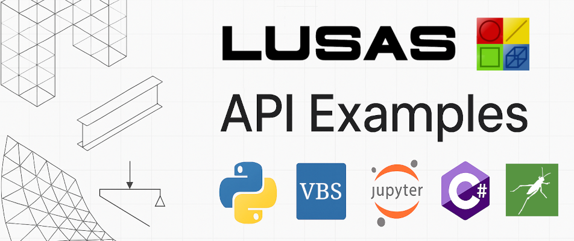
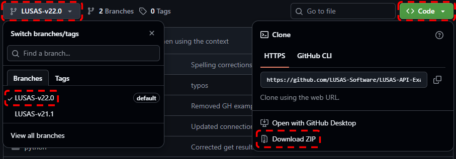

# LUSAS API (LPI) Examples

This repository provides practical and minimal examples of using the LUSAS Programming Interface (LPI) in Python, VBScript, Jupyter, and C#.

These examples are tailored for **LUSAS v23.0** (see repository branches for other versions).

The full LPI documentation can be found inside the LUSAS installation folder at:
`C:\Program Files (x86)\LUSAS230\Programs (x86)\LPIHelp\lpi.html`

## What is LUSAS?

[LUSAS](https://www.lusas.com/) is a powerful finite element analysis software used for structural, bridge, geotechnical, and general engineering simulation. The **LUSAS Programming Interface (LPI)** allows automation of model generation, material assignment, loading, solving, and result extraction (read more about it [on the website](https://www.lusas.com/products/information/lusas_programmable_interface.html)).

## 📁 Repository Structure

- [`python/`](./python/) – Python examples (executed outside LUSAS)
- [`lpython/`](./lpython/) – LPython examples (Python executed inside LUSAS)
- [`jupyter_notebook/`](./jupyter_notebook/) – Python code blocks notebooks
- [`vbscript/`](./vbscript/) – Legacy examples in VBScript (default LUSAS command bar language)
- [`dotnet/`](./dotnet/) – .NET interop examples (C# & VB.NET)
- [`grasshopper/`](./grasshopper/) – Rhinoceros Grasshopper examples

  Browse each directory to read more about each interaction method.

Beginners are recommended to start with `jupyter_notebook` since its interactive nature allows for step-by-step code execution, immediate result display and has the ability to combine `python` code, text, and visualizations in a single document.

## Prerequisites

- Installed LUSAS v22+
  
  Most scripts will work with the free [evaluation licence](https://www.lusas.com/evaluation/index.html), however the use of a full or [academic](https://www.lusas.com/academic/index.html) licence is recommended.

  The latest LUSAS installer can be found [at the downloads section](https://www.lusas.com/user_area/download/index.html) of the official website.
- For Python and Jupyter Notebook examples:
  - Installed Python (v3+)
- For C# examples:
  - Visual Studio 2019
- For Grasshopper examples:
  - Rhinoceros (v8.08 or later)
  - Grasshopper LUSAS plugin

    For step by step installation guides, see each relevant directory.

## 🏃🏽 Get started

To get started running the examples in this repository:
1. Select the correct branch for your LUSAS version (top of page).
2. Get the files from `Code` > `Download ZIP` (top of page).
3. Follow the instructions to install and set up [python](./python/README.md) and [jupyter notebooks](./jupyter_notebook/README.md).

## 🤖 Using AI tools alongside this repository

See the [use AI tools guide](./USE_AI_TOOLS.md) for tips on leveraging AI assistants (such as GitHub Copilot) to explore, generate, and understand code examples in this repository. The guide covers common AI-assisted workflows, troubleshooting, and best practices to maximize productivity with LUSAS API examples.

## 🤝 Contributing

We welcome contributions!  You can contribute by:

*   **Asking API Questions:** Open an [Issue](https://github.com/LUSAS-Software/LUSAS-API-Examples/issues) for questions.
*   **Sharing Examples:** Submit a [Pull Request](https://github.com/LUSAS-Software/LUSAS-API-Examples/pulls) or open an [Issue](https://github.com/LUSAS-Software/LUSAS-API-Examples/issues) with your code.

## 📄 License

MIT License

## 🔗 Links

- [LUSAS Official Site](https://www.lusas.com/)
- [Grasshopper LUSAS plug in](https://www.food4rhino.com/en/app/lusasgrasshopper)
- [LUSAS LPI Customisation and Automation Guide](https://www.lusas.com/user_area/documentation/V20_0/LPI%20Customisation%20and%20Automation%20Guide.pdf) (LPI & VBS)
- [LUSAS LPI Developer Guide](https://www.lusas.com/user_area/documentation/V22_0/LPI%20Developer%20Guide.pdf) (.NET & COM)
- [Using Python with LUSAS Modeller](https://www.lusas.com/user_area/documentation/1037_Using_Python_with_LUSAS_Modeller.pdf) (Python)
