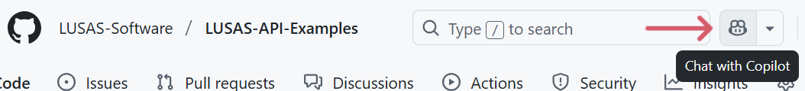
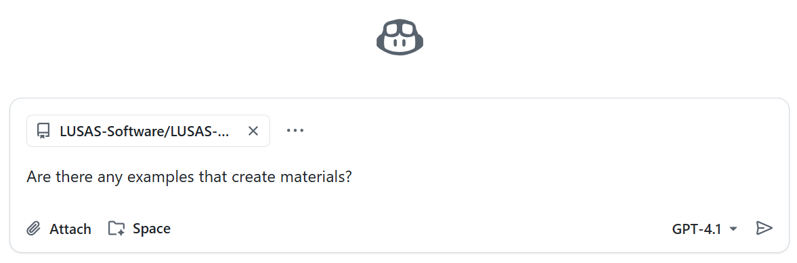

# Using AI Tools

This guide outlines how to make use of AI tools (such as GitHub Copilot and other AI-powered assistants) to maximise productivity and insight when working with the LPI and this repository.

## 1. Getting Started

The easiest way to use an LLM (Large Language Model) with this repository is by using GitHub Copilot. To do so, follow these steps:
1. Ensure that you are logged in to your GitHub account.
2. Navigate to the repository's [main page](https://github.com/LUSAS-Software/LUSAS-API-Examples).
3. Click on the `Chat with Copilot` button at the top of the page:

  
4. Ask a question; for example:
  > Are there any examples that create materials?

  
---

## 2. Common AI-Assisted Workflows

### A. Exploring Examples
Use an AI assistant to find a relevant example:

- **Ask for Example Usage**:

  > Show me an example of how to extract element results.

- **Navigate to Relevant Files**:

  > Which file demonstrates how to create materials?

  > List all files that show how to ____.

### B. Generating and Modifying Code
Generate a custom code example or code snippets:

- **Generate Code**:

  > Give me a code snippet of how to create and assign materials

  > Write a new example that combines ____ and ____.

- **Ask for Customizations**: 

  > How do I modify the '04_Line_Creation.py' example to use a different unit system?
  
- **Convert between programming languages**: 

  > Convert this example to Python.

### C. Understanding the API
AI can help you understand or summarise the used code:

- **Explain Code Sections**:

  > Explain what happens in the '32_User_Defined_Results_and_Design_Attributes.py' script.

- **Summarize Notebooks**:  

  > Summarize the workflow in '30 Getting Results.ipynb'.

### D. Troubleshooting & Debugging
If you encounter an error, use AI to try to resolve it:

- **Describe Errors**:  

  > What does this error mean and how can I fix it?

---

## 4. Best Practices

- **Be Specific**:

  Ask AI targeted questions for best results.
  
  If you notice that the AI hallucinates or the answers deviate from the repository content, refrase your prompts to start with:

  > Base on this repository, ...

  > Base on example _____, create a script that...

- **Verify Suggestions**:

  Always review AI suggestions and test any AI-generated code before using it on projects.

- **Iterative Improvement**:

  Use AI to refactor or optimize code snippets from the examples.

