# Grasshopper Examples

Grasshopper is a visual programming language and environment that runs within the Rhinoceros 3D computer-aided design (CAD) application.

Grasshopper can interact directly with LUSAS through the official LUSAS plugin.

## Prerequisites

- Licensed **Rhinoceros**
- **Grasshopper LUSAS plugin** (get it at [Food4Rhino](https://www.food4rhino.com/en/app/lusasgrasshopper))
- Licensed **LUSAS** (optional, if not installed, a file can be created by the plugin and passed to a LUSAS user who does)

## 📚 Examples

| ###################################### | ###################################### |
| ----------------------- | ----------------- |
| 01. **Cooling tower**                                  | 02. **Curved plate girder bridge**                     |
| 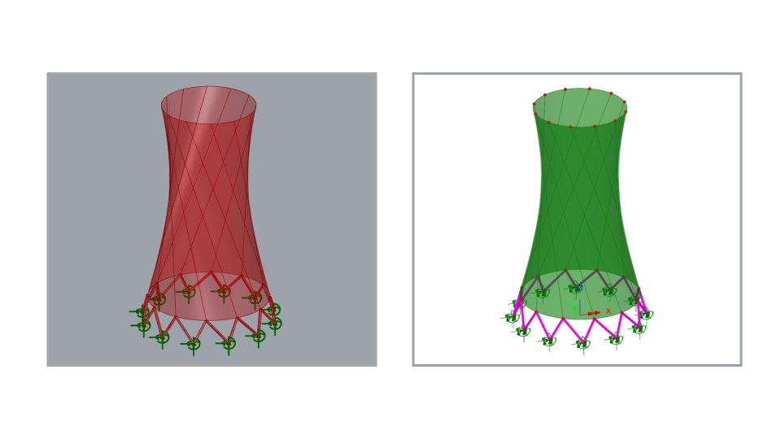     | 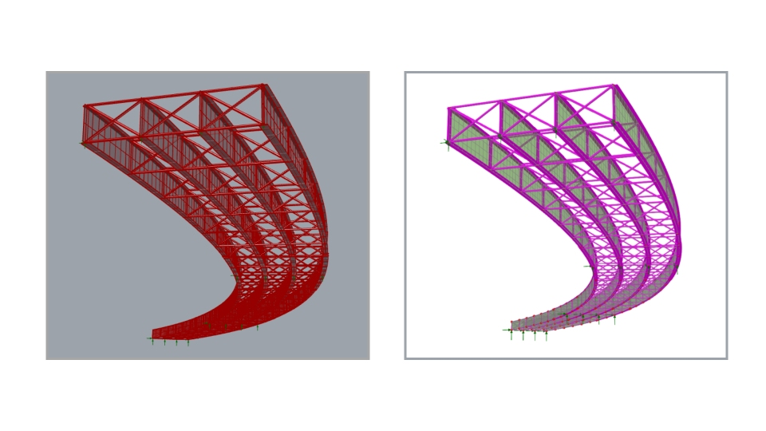     |
| 01_LUSAS_GH_CoolingTower.gh                            | 02_LUSAS_GH_CurvedPlateGirderBridge.gh                 |
|  |  |
| 03. **Curved tub girder** | 04. **Geodesic roof** |
| 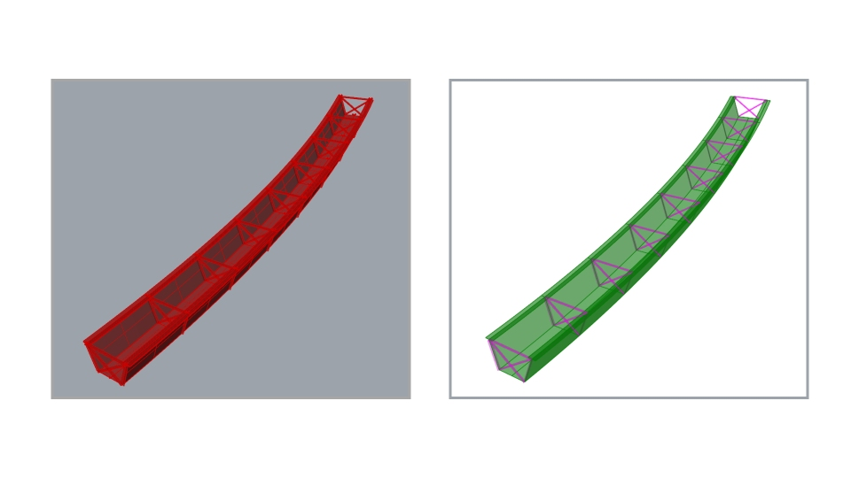 | 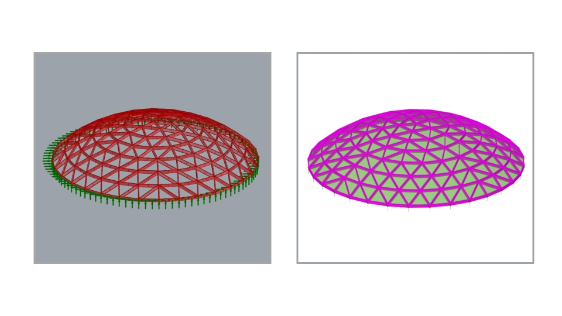     |
| 03_LUSAS_GH_CurvedTubGirder.gh | 04_LUSAS_GH_GeodesicRoof.gh            |
|  |  |
| 05. **Mobius strip** | 06. **Network tied-arch bridge** |
| 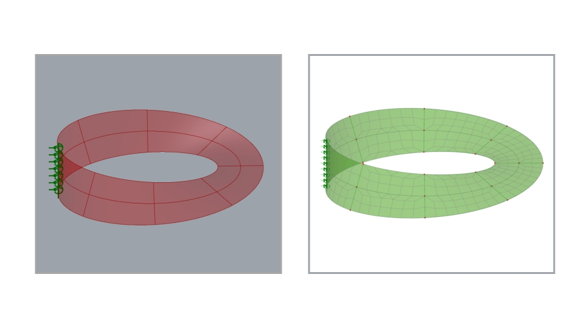      | 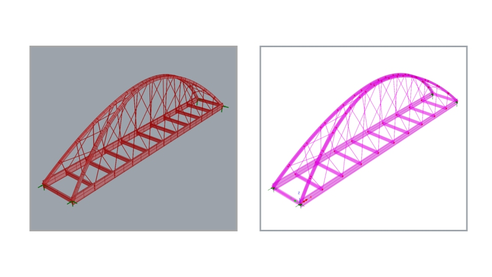         |
| 05_LUSAS_GH_MobiusStrip.gh     | 06_LUSAS_GH_NetworkTiedArchBridge.gh   |
|  |  |
| 07. **Spherical tank** | 08. **Twin girder bridge with vehicle load optimisation** |
| 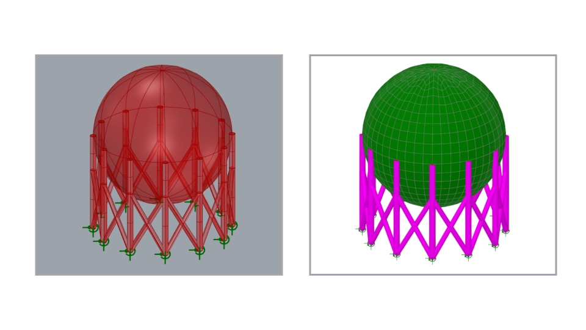    | 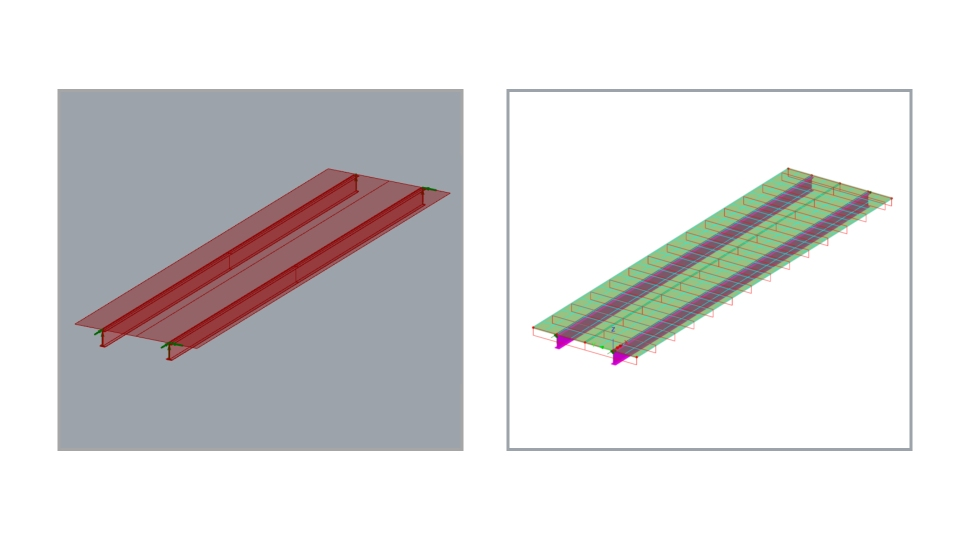   |
| 07_LUSAS_GH_SphericalTank.gh   | 08_LUSAS_GH_TwinGirderBridgeWithVLO.gh |
|  |  |
| 09. **Twisting tower** | 10. **U-frame bridge** |
| 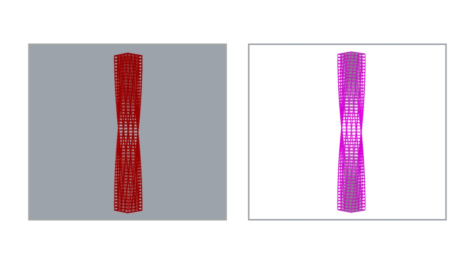    | 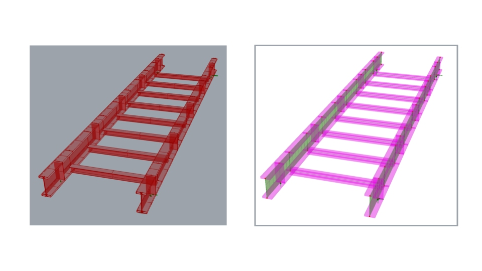     |
| 09_LUSAS_GH_TwistingTower.gh   | 10_LUSAS_GH_UFrameBridge.gh            |
| 11. **Steel-concrete composite twin girder bridge Construction Stages (activation/deactivation)** |  |
| 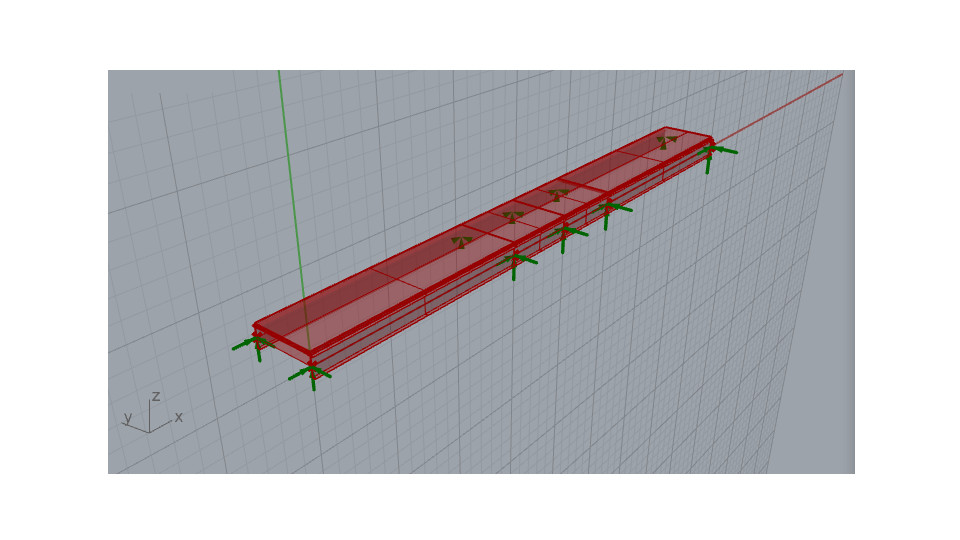    |      |
| 11_LUSAS_GH_ConstructionStages.gh   |  |

Grasshopper examples can also be downloaded from the [relevant page on LUSAS website](https://www.lusas.com/products/external_plugins/grasshopper/index.html).

## 🔗 Relevant Links

- [LUSAS Plugin for Grasshopper - User Manual](https://www.lusas.com/user_area/documentation/grasshopper/LUSAS_plugin_for_Grasshopper.pdf)
- [LUSAS Plugin for Grasshopper - Release History](https://www.lusas.com/products/external_plugins/grasshopper/release_history.html)
- [Other LUSAS Plugins (e.g. Revit, Tekla)](https://www.lusas.com/products/external_plugins/index.html)
