# Jupyter Notebook Wizard Examples

This directory includes examples that create structures.

## 📚 Examples Included

| #   | Name / Preview / File / Description               |
| --- | ------------------------------------------------- |
| 52  | **Simple Shell Girder**                           |
|     | 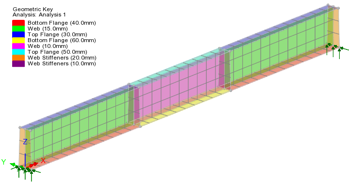 |
|     | 52 Simple Shell Girder.ipynb                      |
|     | Steel I girder modelled in shell elements with linear static analysis |
|     |                                                   |
| 60  | **RC Tee Beam Design**                            |
|     | 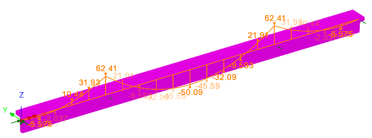 |
|     | 60 RC Tee Beam Design.ipynb |
|     | Creates a multispan Tee beam with reinforcement ready for RC Design checks |
|     |                                                   |
| 300 | **Warren truss rail bridge**                      |
|     | 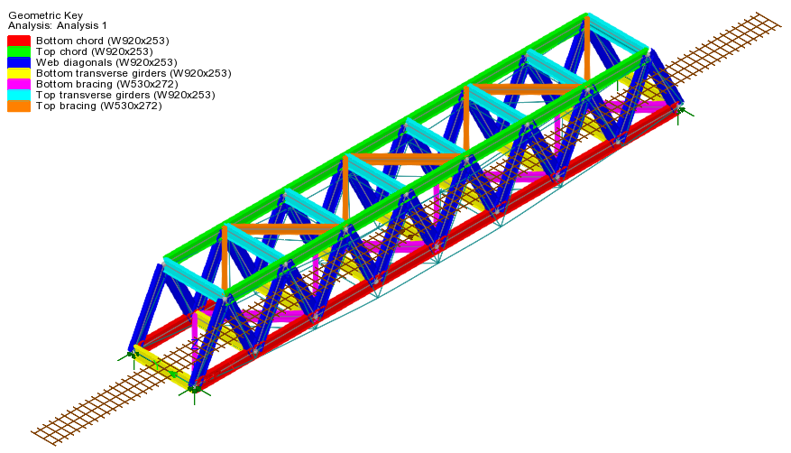 |
|     | 300 Warren Truss Rail Bridge.ipynb                |
|     | A basic steel truss bridge structure is modelled with beam elements. Track layouts are created for subsequent optimisation of rail loading   |
|     |                                                   |
| 305  | **Braced pair of girders**                       |
|     | 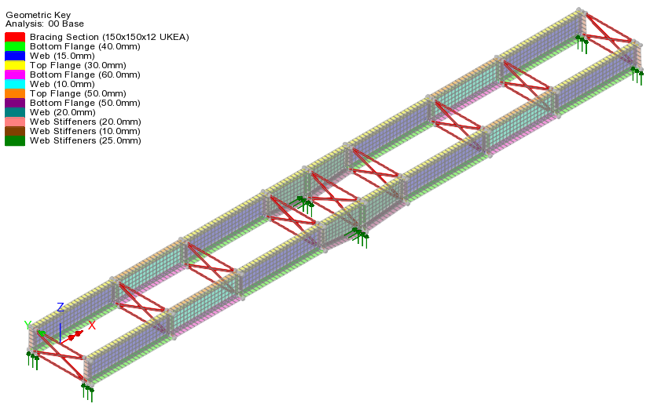 |
|     | 305 Braced pair of girders.ipynb                  |
|     | Models a pair of braced steel girders and carries out linear buckling analysis |
|     |                                                   |
| 310 | **Composite Steel Girders - Staged Construction** |
|     | 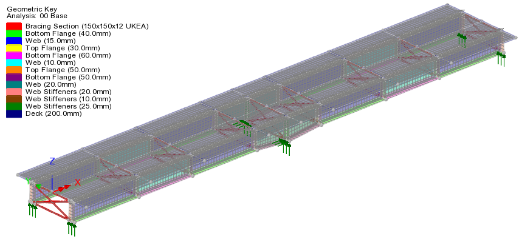 |
|     | 310 Composite Steel Girders - Staged Construction.ipynb |
|     | Models a two-span composite steel girder bridge with concrete deck slab poured in stages. Buckling analyses are performed for each intermediate construction stage |
|     |                                                   |
| 400 | **Precast Super T Beam Bridge Deck**              |
|     | 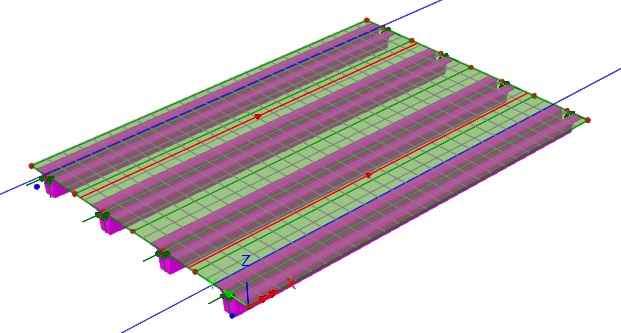 |
|     | 400 Precast Super T Beam Bridge Deck.ipynb        |
|     | Beams are modelled with beam elements and the deck slab is modelled with shell elements. |
|     |                                                   |
| 401 | **Precast Super T Beam Bridge Deck - Offset supports** |
|     | 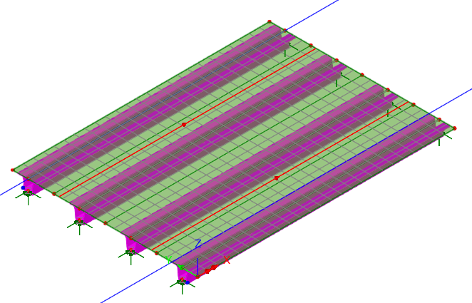 |
|     | 401 Precast Super T Beam Bridge Deck - Offset supports.ipynb |
|     | Beams are modelled with beam elements and the deck slab is modelled with shell elements. The bearings are offset with rigid links to the underside of the concrete beams. |
|     |                                                   |
| 402 | **Concrete Culvert**                              |
|     | 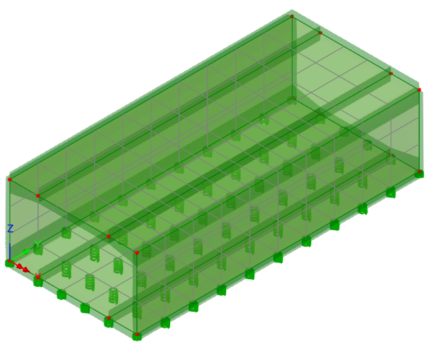 |
|     | 402 Concrete Culvert.ipynb                        |
|     | Creates a basic 3D box culvert on spring foundations |
|     |                                                   |
| 410 | **Concrete Slab Bridge**                          |
|     | 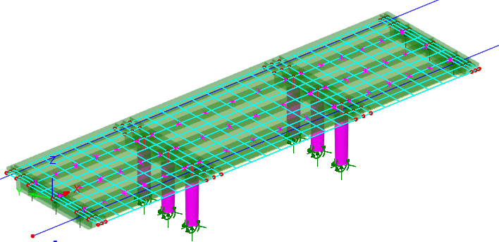 |
|     | 410 Concrete Slab Bridge.ipynb                    |
|     | Deck slab modelled in shell elements and piers modelled with beam elements. 3 options for creating influence analysis are demonstrated ready for traffic load optimisation |
|     |                                                   |
| 450 | **Concrete Cracking**                             |
|     | 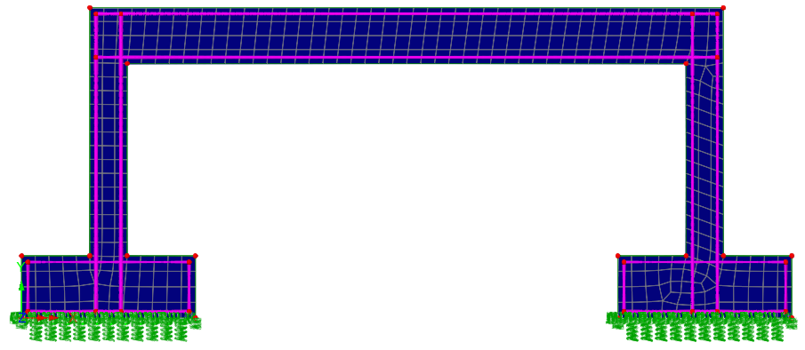 |
|     | 450 Concrete Cracking.ipynb                       |
|     | Creates a 2D nonlinear concrete cracking model with parasitic bars in a frame structure |
|     |                                                   |
| 451 | **Half Joint**                                    |
|     | 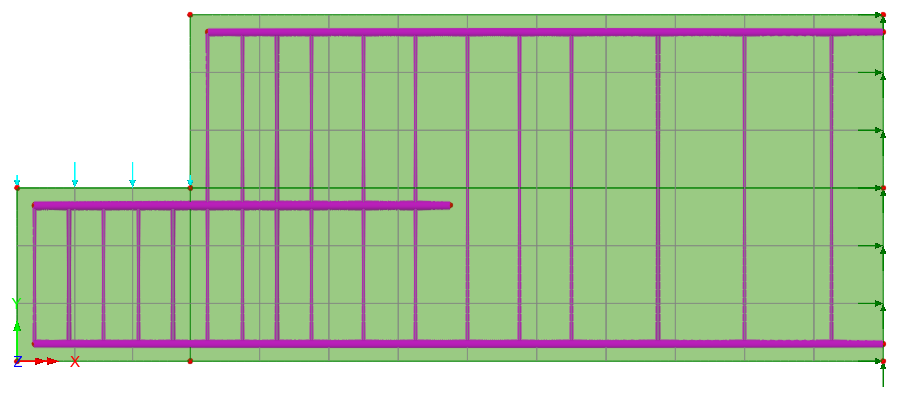 |
|     | 451 Half Joint.ipynb                              |
|     | Creates a 2D nonlinear concrete cracking model with parasitic bars modelling a concrete half joint |

