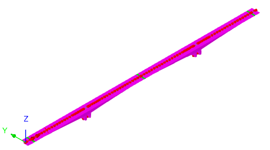
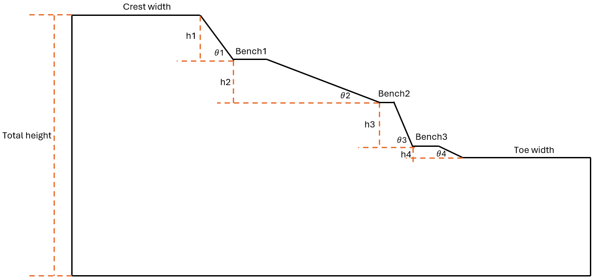
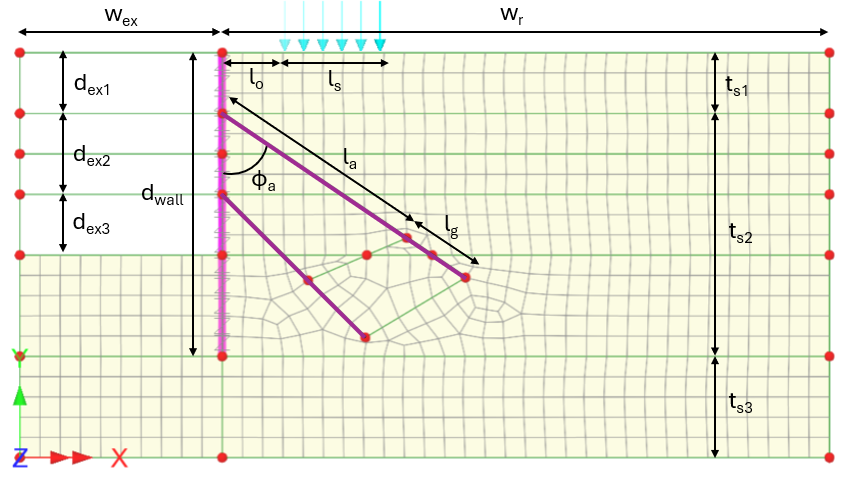

# Python Parametric Models Examples

This directory includes examples that create parametric structures.

## 📚 Examples Included

| #   | Name / Preview / File / Description               |
| --- | ------------------------------------------------- |
| 412 | **Free Cantilever Method model**                            |
|     |  |
|     | Free Cantilever Method model.py                            |
|     | Spline model of a bridge using the LUSAS free cantilever method (FCM) wizard |
|     |                                                   |
| 501 | **2D Bridge Abutment**                            |
|     |  |
|     | 501 Bridge Abutment.py                            |
|     | 2D Bridge Abutment model with adjustable geometry and MC model for the soil behaviour |
|     |                                                   |
| 502 | **2D Tunnel**                                     |
|     |  |
|     | 502 Tunnel.py                                     |
|     | 2D Tunnel section model with adjustable geometry and MC model for the soil behaviour |
|     |                                                   |
| 503 | **Slope**                                         |
|     |  |
|     | 503 Slope.py                                      |
|     | 2D Slope section model with adjustable geometry and MC model for the soil behaviour |
|     |                                                   |
| 504 | **Excavation**                                    |
|     |  |
|     | 504 Excavation.py                                 |
|     | 2D Excavation model with adjustable geometry      |