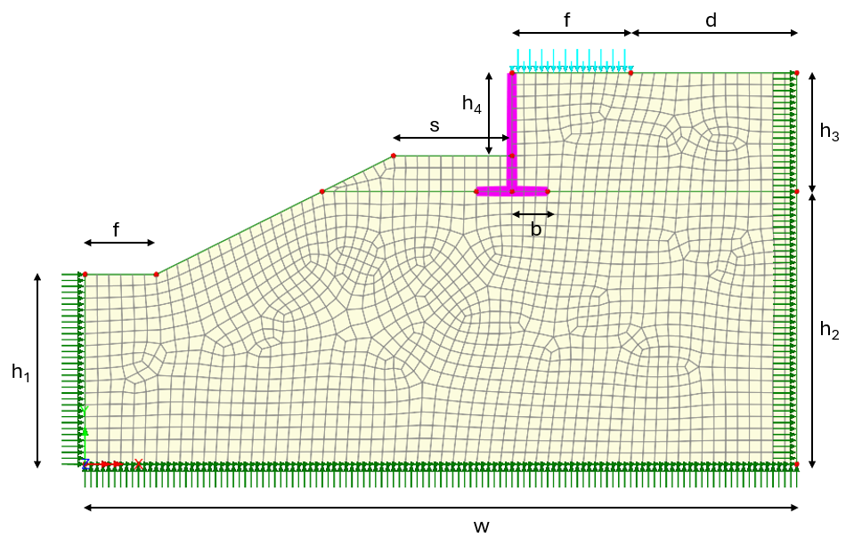
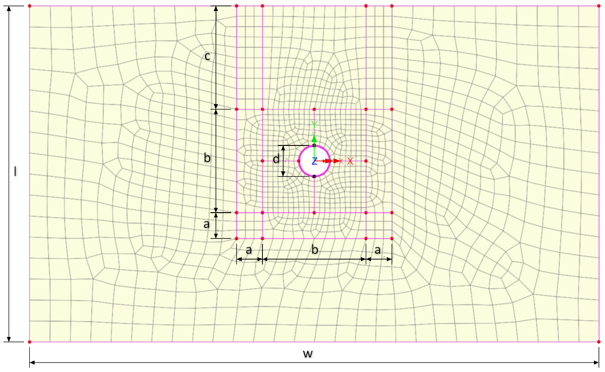

# Python Parametric Models Examples

This directory includes examples that create parametric structures.

## 📚 Examples Included

| #   | Name / Preview / File / Description               |
| --- | ------------------------------------------------- |
| 501 | **2D Bridge Abutment**                           |
|     |  |
|     | 501 Bridge Abutment.py                      |
|     | 2D Bridge Abutment model with adjustable geometry and MC model for the soil behaviour |
|     |                                                   |
| 502 | **2D Tunnel**                           |
|     |  |
|     | 502 Tunnel.py                      |
|     | 2D Tunnel section model with adjustable geometry and MC model for the soil behaviour |
|     |                                                   |